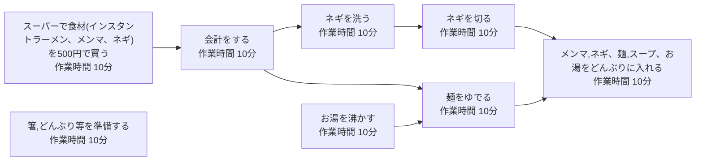

```mermaid
graph LR;

    kaikei["会計をする
    作業時間 10分"]
    go_super["スーパーで食材(インスタントラーメン、メンマ、ネギ)を500円で買う
    作業時間 10分"]
    wash_negi["ネギを洗う
    作業時間 10分"]
    
    bail_water["お湯を沸かす
    作業時間 10分"]
    bail_men["麺をゆでる
    作業時間 10分"]
    in_menma["メンマ,ネギ、麺,スープ、お湯をどんぶりに入れる
    作業時間 10分"]
    hashi["箸,どんぶり等を準備する
    作業時間 10分"]
    cut_negi["ネギを切る
    作業時間 10分"]


    go_super --> kaikei;
    kaikei --> wash_negi;
    kaikei -->bail_men;
    wash_negi --> cut_negi;
    bail_water --> bail_men;
    cut_negi --> in_menma;
    bail_men --> in_menma;

``` 