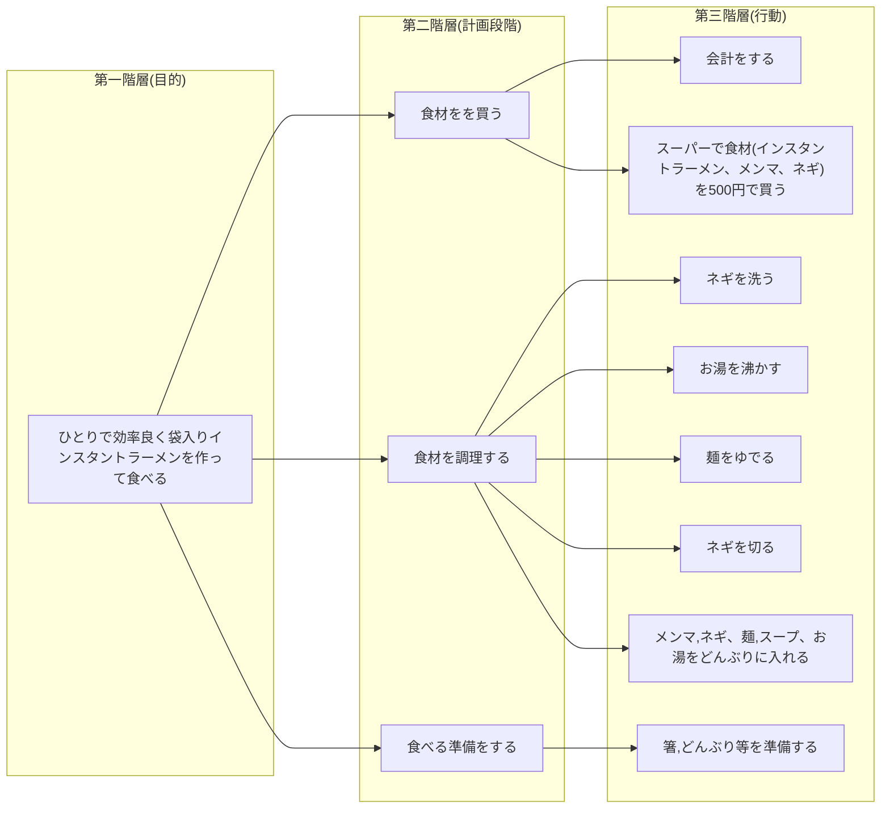

```mermaid
graph LR;
subgraph "第一階層(目的)"
    eat_egg["ひとりで効率良く袋入りインスタントラーメンを作って食べる"]
end
subgraph "第二階層(計画段階)"
    buy_egg["食材をを買う"]
    cook_egg["食材を調理する"]
    eatset_egg["食べる準備をする"]
end

subgraph "第三階層(行動)"
    kaikei["会計をする"]
    go_super["スーパーで食材(インスタントラーメン、メンマ、ネギ)を500円で買う"]
    wash_negi["ネギを洗う"]
    bail_water["お湯を沸かす"]
    bail_men["麺をゆでる"]
    in_menma["メンマ,ネギ、麺,スープ、お湯をどんぶりに入れる"]
    hashi["箸,どんぶり等を準備する"]
    cut_negi["ネギを切る"]
end


    eat_egg ---> buy_egg
    eat_egg ---> cook_egg
    eat_egg ---> eatset_egg


    buy_egg --> kaikei
    buy_egg --> go_super

    cook_egg --> wash_negi;
    cook_egg --> bail_water;
    cook_egg --> bail_men;
    cook_egg --> cut_negi;
    cook_egg --> in_menma;


    eatset_egg --> hashi;
``` 
