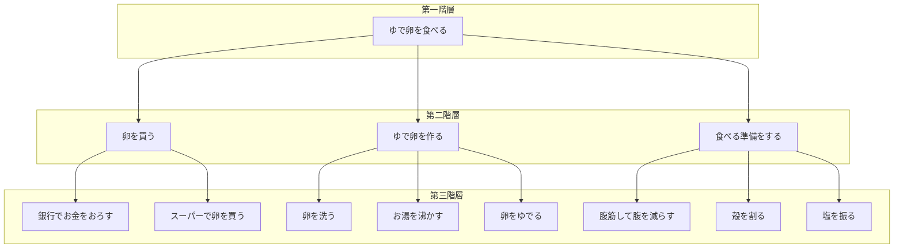

```mermaid
graph TD;
subgraph "第一階層"
    eat_egg["ゆで卵を食べる"]
end
subgraph "第二階層"
    buy_egg["卵を買う"]
    cook_egg["ゆで卵を作る"]
    eatset_egg["食べる準備をする"]
end

subgraph "第三階層"
    go_bank["銀行でお金をおろす"]
    go_super["スーパーで卵を買う"]
    wash_egg["卵を洗う"]
    bail_water["お湯を沸かす"]
    bail_egg["卵をゆでる"]
    hungry["腹筋して腹を減らす"]
    crash_egg["殻を割る"]
    sio_egg["塩を振る"]
end


    eat_egg ---> buy_egg
    eat_egg ---> cook_egg
    eat_egg ---> eatset_egg


    buy_egg --> go_bank
    buy_egg --> go_super

    cook_egg --> wash_egg;
    cook_egg --> bail_water;
    cook_egg --> bail_egg;

    eatset_egg --> hungry;
    eatset_egg --> crash_egg;
    eatset_egg --> sio_egg;
``` 
