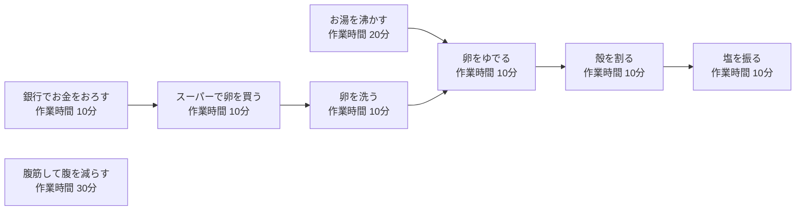

```mermaid
graph LR;
    go_bank["銀行でお金をおろす
    作業時間 10分"]
    go_super["スーパーで卵を買う
    作業時間 10分"]
    wash_egg["卵を洗う
    作業時間 10分"]
    bail_water["お湯を沸かす
    作業時間 20分"]
    bail_egg["卵をゆでる
    作業時間 10分"]
    hungry["腹筋して腹を減らす
    作業時間 30分"]
    crash_egg["殻を割る
    作業時間 10分"]
    sio_egg["塩を振る
    作業時間 10分"]


    go_bank --> go_super

    go_super --> wash_egg;
    bail_water --> bail_egg;
    wash_egg --> bail_egg;

    bail_egg --> crash_egg;
    crash_egg --> sio_egg;
``` 